### 标量导数

 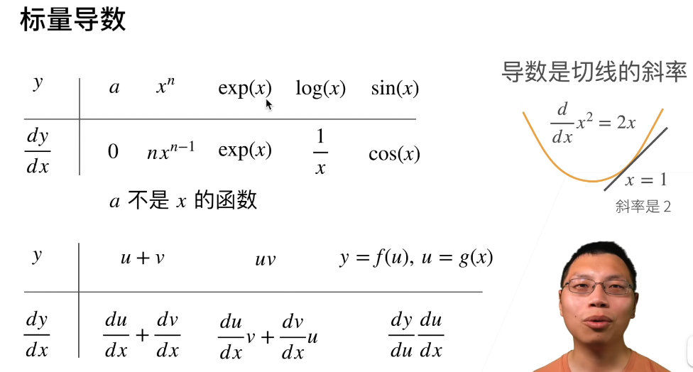

###   亚导数

 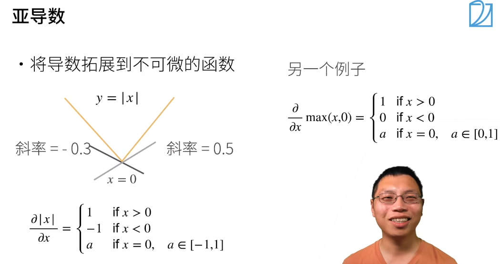

### 梯度

**形状要搞对**

梯度指向值变化最大的方向  -> 今后所有机器学习求解的核心思想

 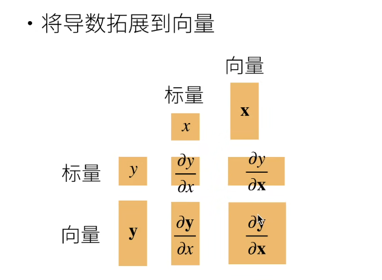

#### 样例

 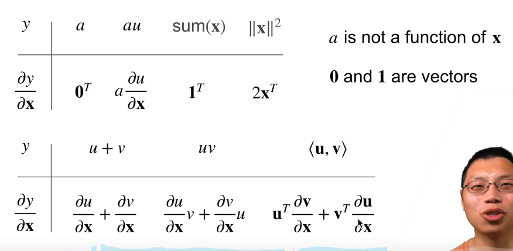

dy/dx是行向量，dy/dx是列向量

* 这个被称之为**分子布局符号**，反过来的版本叫分母布局符号

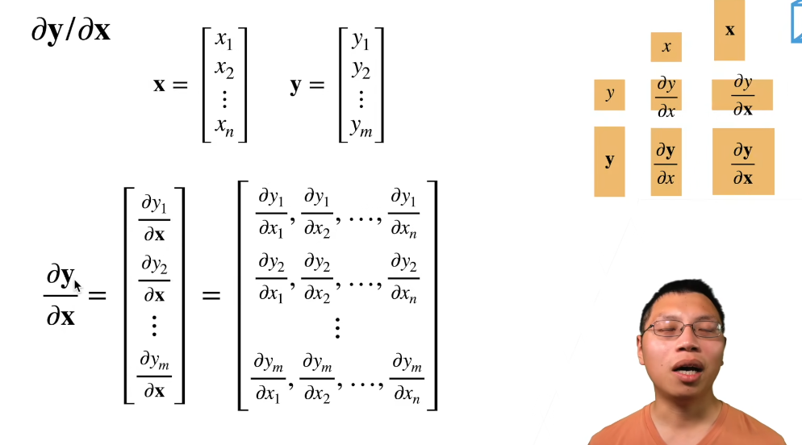 

#### **向量相除样例**

-> 第一行后两个比较重要

 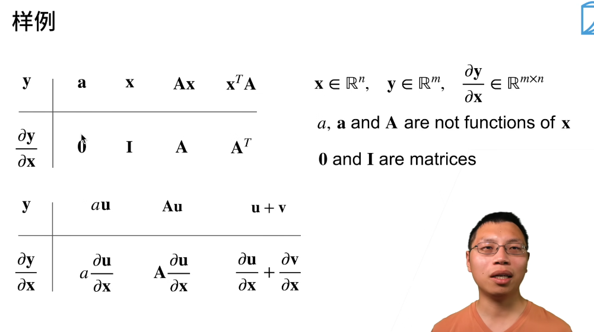

#### **拓展到矩阵**

 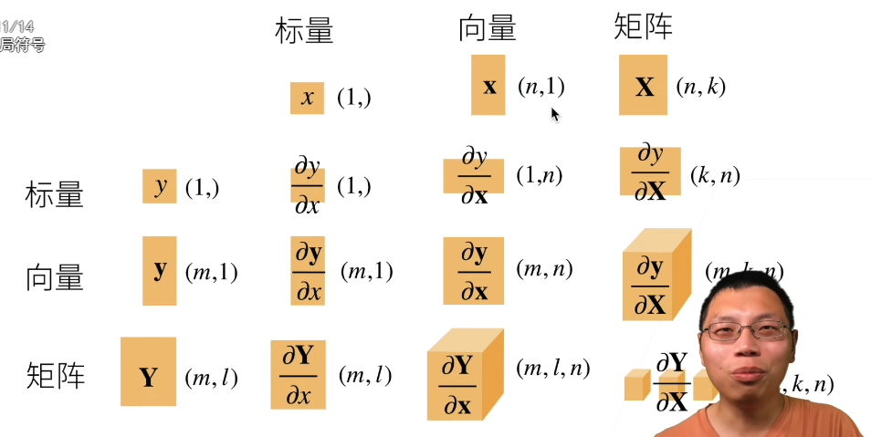


### 向量链式法则

 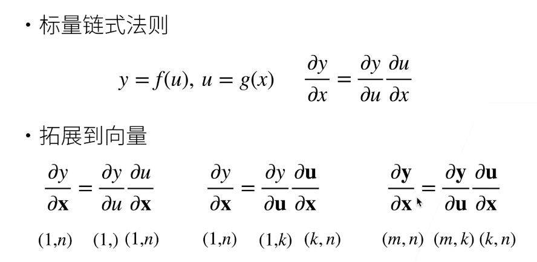

#### 样式1

 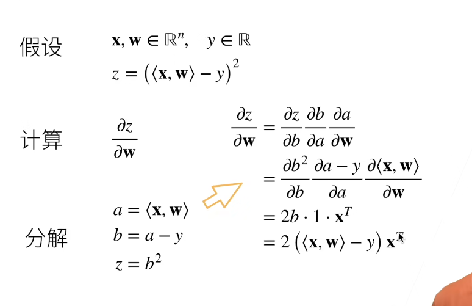

#### 样例2

 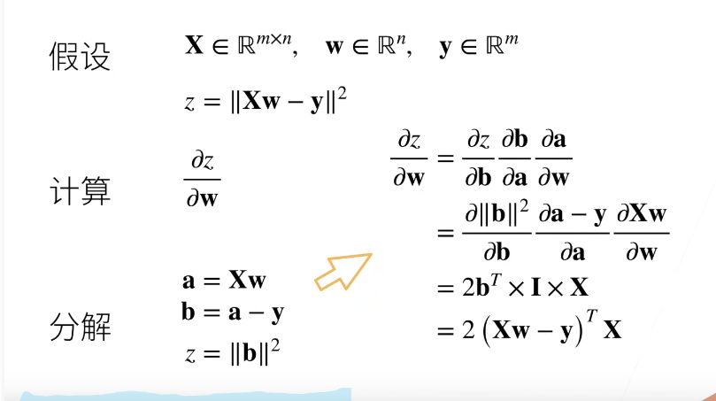


### 自动求导

 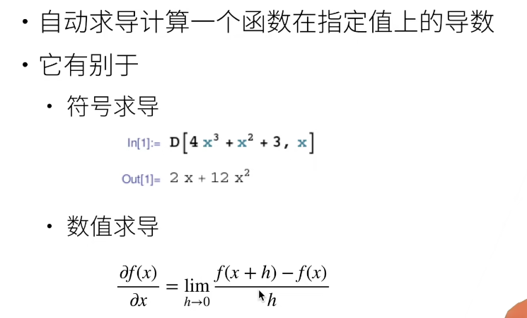

#### 计算图

* 将代码分解成操作子
* 将计算表示成一个无环图

 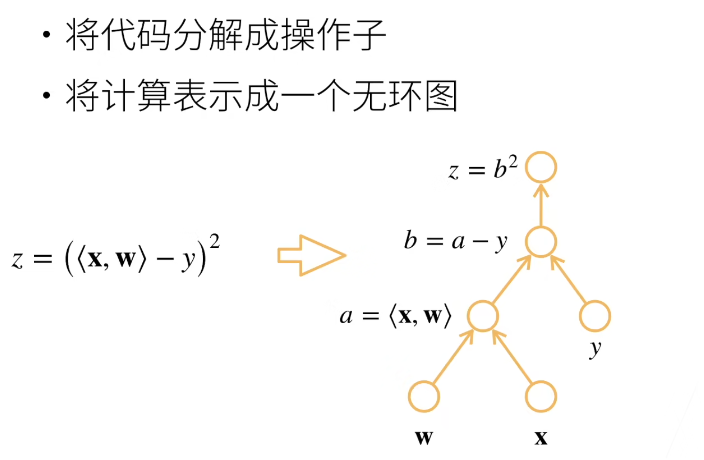

```py
# 显示构造
from mxnet import sym

a = sym.var()
b = sym.var()
c = 2 * a + b
```

```py
# 隐式构造
from mxnet import autograd, nd

with autograd.record():
    a = nd.ones((2, 1))
    b = nd.ones((2, 1))
    c = 2 * a + b
```

### 自动求导的两种模式

 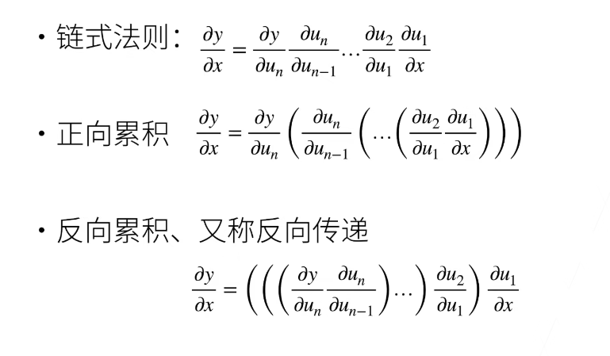

#### 方向累积

 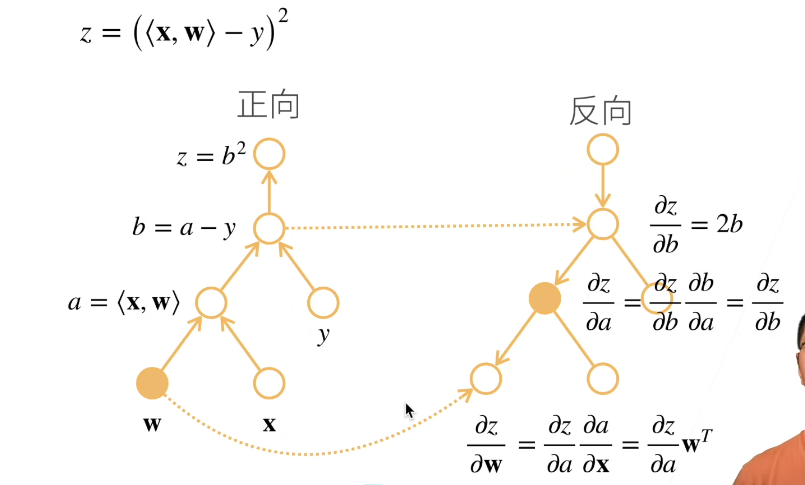

反向累积总结


复杂度

* 计算复杂度：O(n), n是操作子个数
  * 通常正向和方向的代价类以
* 内存复杂度：O(n)，因为需要存储正向的所有中间结果
* 跟正向累积对比：
  * O(n) 计算复杂度用来计算一个变量的梯度
  * O(1)内存复杂度
